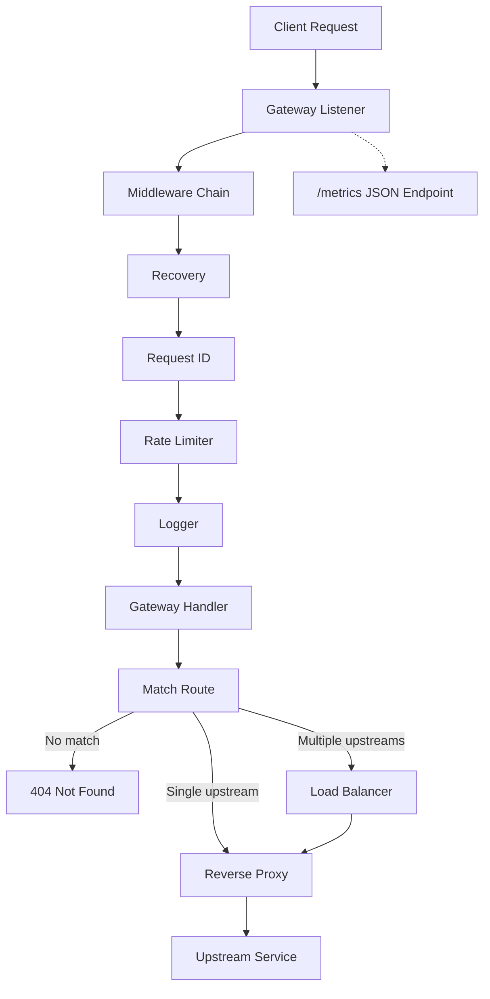
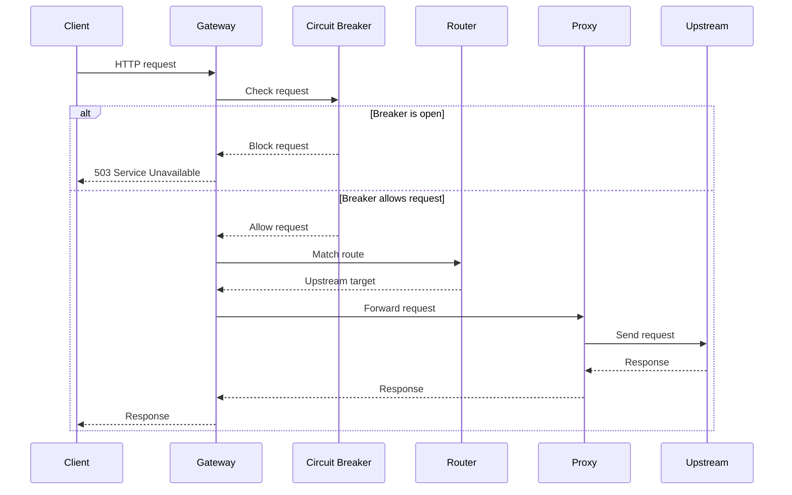

# Vexor

Vexor is a Go API gateway for routing requests to upstream services. It provides prefix-based routing, reverse proxying, load balancing, basic resilience controls, rate limiting, and a small metrics endpoint for runtime visibility.

## Architecture





## Features

- Path prefix routing to upstream services
- Reverse proxying for forwarded requests and responses
- Load balancing for routes with multiple upstreams
- Middleware for panic recovery, request IDs, and request logging
- Circuit breaker protection for unstable upstreams
- Token bucket rate limiting
- JSON metrics at `/metrics`

## Load Balancing

Routes can use a single upstream or multiple upstreams. When multiple instances are configured, Vexor supports:

- Round robin
- Weighted round robin
- Least connections

Route configuration lives in [config.yaml](config.yaml) and is loaded at startup by [internal/config](internal/config). Balancer logic lives in [internal/load_balancer](internal/load_balancer), and rate limiting is configured per route.

## Runtime Behavior

The gateway starts on port `8080` by default. Requests are matched to a route, checked by that route's rate limiter and circuit breaker, and then proxied to the matching upstream service. The server shuts down gracefully on `SIGINT` or `SIGTERM`.

The `/metrics` endpoint returns snapshot data for internal components such as the rate limiter.

## Project Layout

- [cmd/vexor](cmd/vexor)
- [internal/gateway](internal/gateway)
- [internal/config](internal/config)
- [internal/load_balancer](internal/load_balancer)
- [internal/middleware](internal/middleware)
- [internal/observability](internal/observability)
- [internal/ratelimit](internal/ratelimit)
- [internal/breaker](internal/breaker)
- [internal/routing](internal/routing)

## Run Locally

```bash
go run ./cmd/vexor
```

To verify the build and tests:

```bash
go build ./...
go test ./...
```

## Configuration

Routes are defined in [config.yaml](config.yaml). The file is loaded at startup and can be overridden with the `VEXOR_CONFIG` environment variable. A route can point to one upstream with `Target` or multiple upstreams with `Targets` and a balancing `Strategy`.

Example:

```yaml
routes:
    - path: /users
        targets:
            - http://localhost:3001|1
            - http://localhost:3003|2
        strategy: weighted
        rate_limit:
            strategy: token_bucket
            capacity: 100
            refill_rate: 10
    - path: /orders
        target: http://localhost:3002
        rate_limit:
            strategy: fixed_window
            limit: 100
```

## Requirements

- Go 1.22 or later
