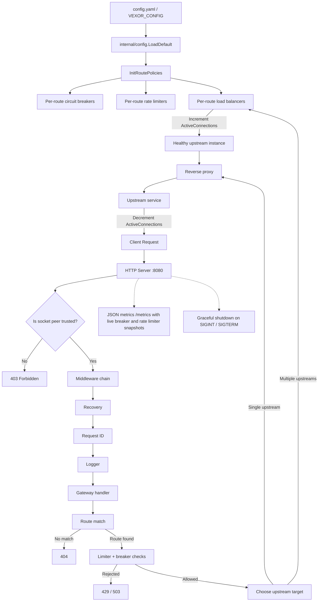
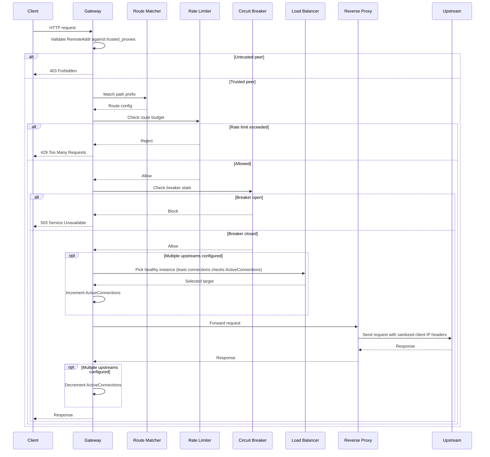

# Vexor

Vexor is a compact Go API gateway built around route-local policy control. It loads configuration at startup, applies rate limiting and circuit breaking per route, load balances across healthy upstreams, and forwards traffic through a hardened reverse proxy with runtime metrics.

What makes it stand out is the combination of simplicity and control: you can define routes in one config file, attach resilience policies to each route, and choose how traffic is distributed when a route fans out to multiple upstreams.

## Architecture





## Main Features

* Config-driven routing from [config.yaml](config.yaml), with `VEXOR_CONFIG` support for alternate file locations.
* Prefix-based route matching for simple gateway-style traffic control.
* Route-local circuit breakers so one unstable upstream does not poison unrelated traffic.
* Route-local rate limiting with multiple strategies, including token bucket, fixed window, sliding counter, and sliding log.
* Load balancing across healthy upstream instances with round robin, weighted round robin, and least connections (with atomic active connection tracking).
* Hardened reverse proxy behavior that checks request source against a trusted proxy whitelist, strips inbound `X-Forwarded-For` and `X-Real-IP`, and rewrites them from the real client address.
* Built-in JSON observability at `/metrics` providing real-time metrics snapshots for routes, rate limiters, and circuit breakers.
* Graceful shutdown and request middleware for panic recovery, request IDs, and logging.

## Why It Is Impressive

* The gateway is not just forwarding traffic: it composes policies per route, so the control plane is nearly as important as the data plane.
* Multi-target routes automatically become health-aware and skip unhealthy instances.
* The proxy transport is tuned with dial and response-header timeouts instead of relying on default network behavior.
* The request path is cleanly layered: middleware, route selection, resilience checks, balancing, and proxying.

## Load Balancing

Routes can use a single upstream or multiple upstreams. When multiple instances are configured, Vexor supports:

* Round robin
* Weighted round robin
* Least connections (leveraging atomic connection counters to dynamically balance request volume)

Route configuration lives in [config.yaml](config.yaml) and is loaded at startup by [internal/config](internal/config). Balancer logic lives in [internal/load_balancer](internal/load_balancer), and rate limiting is configured per route.

## Runtime Behavior

The gateway starts on port `8080` by default. During startup it loads routes, initializes route-local policies, and registers metrics. Requests are then validated for source IP permissions, matched to a route, checked by that route's limiter and circuit breaker, and proxied to the selected upstream service.

The reverse proxy uses a custom transport with connection and response-header timeouts, and it rewrites client IP headers from the actual request source before forwarding upstream.

The server shuts down gracefully on `SIGINT` or `SIGTERM`.

The `/metrics` endpoint returns live snapshot data for internal components including routes, rate limiter strategies, and circuit breakers.

## Benchmarks

Local benchmark run against the token bucket limiter:

* Command: `go test ./internal/ratelimit/strategy -run '^$' -bench BenchmarkTokenBucketAllow -benchmem -count=1`
* Result: `BenchmarkTokenBucketAllow-18  47114251  23.54 ns/op  0 B/op  0 allocs/op`

## k6 Load Test

Use [test/k6/gateway.js](test/k6/gateway.js) to drive a live gateway instance. It targets a configurable route path so you can point it at any upstream-backed route in your local or staging setup.

This is a load test, not a microbenchmark. `k6 inspect` only shows the configured scenario; the actual run produces throughput, latency, and error-rate results against a live gateway.

Example:

```bash
k6 run -e VEXOR_URL=http://127.0.0.1:8080 -e VEXOR_PATH=/users -e VUS=10 -e DURATION_SECONDS=30 test/k6/gateway.js
```

## Project Layout

* [cmd/vexor](cmd/vexor)
* [internal/gateway](internal/gateway)
* [internal/config](internal/config)
* [internal/load_balancer](internal/load_balancer)
* [internal/middleware](internal/middleware)
* [internal/observability](internal/observability)
* [internal/ratelimit](internal/ratelimit)
* [internal/breaker](internal/breaker)
* [internal/routing](internal/routing)

## Run Locally

```bash
go run ./cmd/vexor
```

To verify the build and tests:

```bash
go build ./...
go test ./...
```

## Configuration

Routes and trusted proxies are defined in [config.yaml](config.yaml). The file is loaded at startup and can be overridden with the `VEXOR_CONFIG` environment variable. A route can point to one upstream with `Target` or multiple upstreams with `Targets` and a balancing `Strategy`.

Example:

```yaml
trusted_proxies:
  - 127.0.0.1
  - ::1
  - 10.0.0.0/8

routes:
  - path: /users
    targets:
      - http://localhost:3001|1
      - http://localhost:3003|2
    strategy: weighted
    rate_limit:
      strategy: token_bucket
      capacity: 100
      refill_rate: 10
  - path: /orders
    target: http://localhost:3002
    rate_limit:
      strategy: fixed_window
      limit: 100
      window_seconds: 60
```

## Requirements

* Go 1.22 or later
