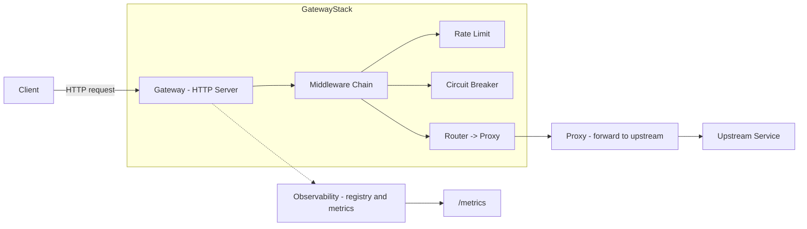
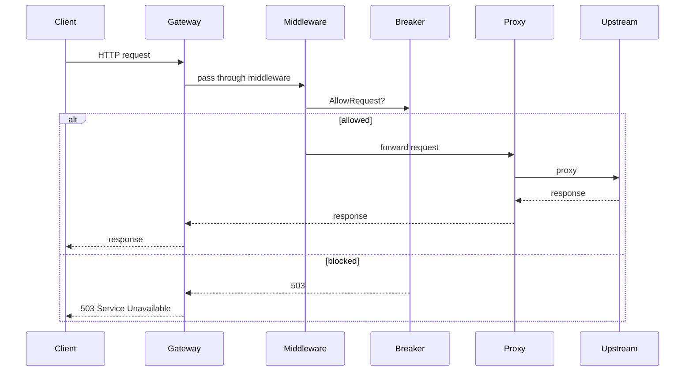

# Vexor

**Vexor** is a lightweight API gateway prototype written in Go. It provides request routing, rate limiting, a circuit breaker, and basic observability primitives intended as a foundation for building resilient HTTP gateways and edge services.

**Contents**
- **Overview** - purpose and goals
- **Architecture** - component diagram and request flow
- **Components** - brief description of source locations
- **Running** - build and run instructions
- **Configuration** - how to wire middleware and metrics
- **Observability** - metrics and logging
- **Development** - testing and contributing notes

**Overview**

Vexor focuses on a small, modular codebase that demonstrates common gateway features:
- Routing and proxying of requests to upstream services
- Per-route or global rate limiting
- Circuit breaker to protect upstream services
- Minimal observability: logging and JSON metrics endpoint

The codebase is organized to keep middleware and core logic small and testable.

**Architecture**

Below is a high-level component diagram showing where incoming requests are handled and how the circuit breaker and observability pieces fit in.



Sequence (request) - simplified:



**Components and key files**

- Gateway entry: [cmd/vexor/main.go](cmd/vexor/main.go#L1-L200)
- HTTP server and handlers: [internal/gateway/server.go](internal/gateway/server.go#L1-L200)
- Routing helpers: [internal/routing/router.go](internal/routing/router.go#L1-L200)
- Circuit breaker: [internal/breaker/breaker.go](internal/breaker/breaker.go#L1-L200)
- Breaker middleware and metrics: [internal/breaker/middleware.go](internal/breaker/middleware.go#L1-L200) and [internal/breaker/metrics.go](internal/breaker/metrics.go#L1-L200)
- Observability primitives: [internal/observability/logger.go](internal/observability/logger.go#L1-L200), [internal/observability/registry.go](internal/observability/registry.go#L1-L200), [internal/observability/handler.go](internal/observability/handler.go#L1-L200)
- Rate limiting strategies: [internal/ratelimit/strategy](internal/ratelimit/strategy)

Where files contain multiple functions, the link range above points to the top of the file; open the file to navigate to specific symbols.

**Running**

Prerequisites:
- Go 1.26 or later installed

Build and run locally:

```bash
go build ./...
# run the gateway (example binary under cmd/vexor)
go run ./cmd/vexor
```

The server listens on the address configured in the gateway server code. Check [internal/gateway/server.go](internal/gateway/server.go#L1-L200) for default bind and port.

**Configuration and wiring**

The code is intentionally modular. To enable the circuit breaker and metrics endpoint you typically:

- create a circuit breaker with `breaker.NewCircuitBreaker(failureThreshold, resetTimeout)`
- wrap route handlers with the breaker middleware: `breaker.Middleware(cb)`
- register the breaker snapshot with the observability registry:

```go
reg := observability.NewRegistry()
cb := breaker.NewCircuitBreaker(5, 10*time.Second)
reg.Register("breaker", func() interface{} { return breaker.Snapshot(cb) })
http.Handle("/metrics", observability.JSONHandler(reg))
```

See the implementation in [internal/observability](internal/observability#L1-L200) for the registry and handler.

**Observability**

Current observability is minimal and intended to be extended: a concurrent-safe `Logger`, a `Registry` to hold snapshot functions, and a JSON handler that returns a combined snapshot. These are found in [internal/observability](internal/observability#L1-L200).

Metrics and debug endpoints
- `/metrics` - aggregated JSON snapshot of registered components
- Breaker metrics - available under the registry name `breaker` when registered

If you want Prometheus integration, add a Prometheus client and register collectors that call into `Registry.Snapshot()` or instrument counters/histograms directly in middleware.

**Development and testing**

Run `go vet` and `go test` for packages you modify. Example:

```bash
go vet ./...
go test ./... -run TestNameHere
```


**Contributing**

1. Fork and create a feature branch
2. Run `go vet` and `go test` locally
3. Open a pull request with a clear description and tests for new behavior

**Next improvements**
- Add configurable endpoints and TLS support
- Add Prometheus metrics integration
- Add graceful shutdown and health-check endpoints
- Add structured logging and log levels

