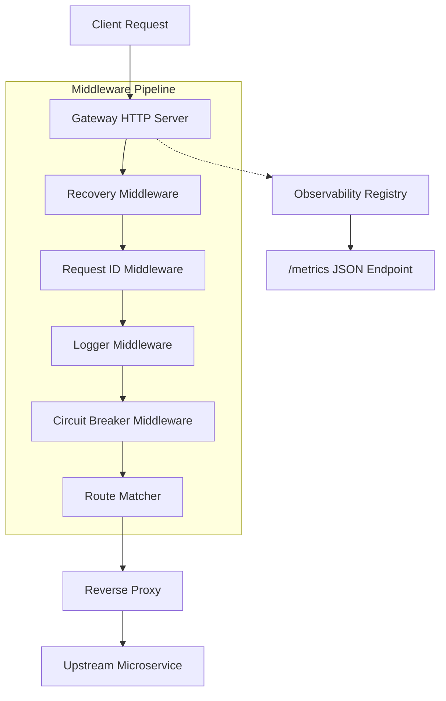
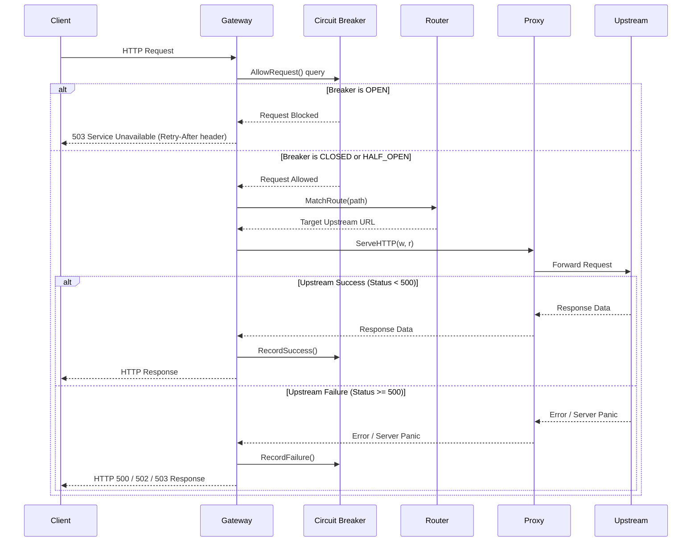

# Vexor: Modular Go API Gateway

Vexor is a lightweight, high-performance API gateway prototype implemented in Go. It is designed to act as a single entry point for microservice architectures, providing request routing, reverse proxying, request tracing, resilience engineering, and flexible rate limiting. The codebase is organized with a focus on modularity, thread safety, and testability, making it an excellent foundation for custom edge service development.

---

## System Architecture

The following diagram illustrates the path of an incoming HTTP request through Vexor's architectural layers before it is forwarded to the corresponding upstream service.



### Detailed Request Flow Sequence

Below is the request sequence path, detailing both a successful proxy flow and a service failure block triggered by the state-aware circuit breaker.



---

## Core Architecture and Features

Vexor separates its core operational logic into specialized Go packages located within the `internal` directory.

### 1. Prefix Routing and Proxying
* [routes.go](https://github.com/jhanvi857/Vexor/blob/main/internal/config/routes.go): Defines configuration structs and the default path routing table.
* [router.go](https://github.com/jhanvi857/Vexor/blob/main/internal/routing/router.go): Implements route matching using a prefix-matching algorithm via `strings.HasPrefix`.
* [proxy.go](https://github.com/jhanvi857/Vexor/blob/main/internal/proxy/proxy.go): Dynamically instantiates a single-host reverse proxy using `net/http/httputil.NewSingleHostReverseProxy`, allowing the gateway to forward header data, request bodies, and stream responses back to the client.

### 2. Pipeline Middleware Chaining
Vexor implements an onion-style HTTP handler middleware pipeline via [chain.go](https://github.com/jhanvi857/Vexor/blob/main/internal/middleware/chain.go). It wraps a base `http.Handler` with multiple layers:
* **Panic Recovery**: [recovery.go](https://github.com/jhanvi857/Vexor/blob/main/internal/middleware/recovery.go) intercepts panics during request execution, prints trace information to logs, and returns a clean `HTTP 500 Internal Server Error`.
* **Request ID Tracking**: [requestid.go](https://github.com/jhanvi857/Vexor/blob/main/internal/middleware/requestid.go) generates a unique `UUIDv4` token for every request, setting it on both the incoming request headers and outgoing response headers (`X-Request-ID`).
* **Request Logging**: [logger.go](https://github.com/jhanvi857/Vexor/blob/main/internal/middleware/logger.go) logs basic HTTP properties such as request method, URL path, and processing latency.

### 3. Thread-Safe Circuit Breaker
To prevent cascading failures across downstream services, the circuit breaker package [breaker.go](file:///c:/Users/family/OneDrive/Desktop/Vexor/internal/breaker/breaker.go) tracks upstream request failures using the following state machine:
* **CLOSED**: Normal operation. All requests are routed. If failures exceed the configured threshold, the state transitions to `OPEN`.
* **OPEN**: Requests are blocked immediately. The gateway returns `HTTP 503 Service Unavailable` containing a `Retry-After` header calculated from the reset timeout.
* **HALF_OPEN**: After the reset duration has elapsed, a single test request is allowed. A success resets the state back to `CLOSED`, whereas any failure returns it immediately to `OPEN`.

The circuit breaker is implemented as a thread-safe struct utilizing `sync.Mutex` to protect its internal state values. The middleware handling this logic is located in [middleware.go](https://github.com/jhanvi857/Vexor/blob/main/internal/breaker/middleware.go). The state definitions and string helpers are in [state.go](https://github.com/jhanvi857/Vexor/blob/main/internal/breaker/state.go).

### 4. Rate Limiting Strategies
Vexor implements four distinct rate limiting algorithms under the [internal/ratelimit/strategy](https://github.com/jhanvi857/Vexor/tree/main/internal/ratelimit/strategy) package:
* **Fixed Window**: Tracks the number of requests within a defined time window. It is implemented in [fixed_window.go](https://github.com/jhanvi857/Vexor/blob/main/internal/ratelimit/strategy/fixed_window.go). Once the window expires, the request counter is reset to zero.
* **Sliding Window Counter**: Implemented in [sliding_counter.go](https://github.com/jhanvi857/Vexor/blob/main/internal/ratelimit/strategy/sliding_counter.go), this algorithm divides a sliding window into discrete sub-windows (buckets). It maintains counters in each bucket and advances them incrementally based on elapsed time, smoothing out request bursts.
* **Sliding Log**: Tracks request history as a slice of timestamps in [sliding_log.go](https://github.com/jhanvi857/Vexor/blob/main/internal/ratelimit/strategy/sliding_log.go). Old timestamps falling outside the rolling window are pruned. It offers high precision at the expense of memory storage.
* **Token Bucket**: Implemented in [token_bucket.go](https://github.com/jhanvi857/Vexor/blob/main/internal/ratelimit/strategy/token_bucket.go), it refills tokens into a bucket of fixed capacity at a configured rate. Requests consume a token. This strategy naturally supports burst traffic while enforcing a strict maximum refill rate.

### 5. Observability and Core Registry
Monitoring system state is managed by the observability package:
* **Registry**: [registry.go](https://github.com/jhanvi857/Vexor/blob/main/internal/observability/registry.go) provides a thread-safe repository where components register custom snapshot functions.
* **Logger**: [logger.go](https://github.com/jhanvi857/Vexor/blob/main/internal/observability/logger.go) exposes a thread-safe wrapper over standard logging with custom prefixes for `DEBUG`, `INFO`, and `ERROR` levels.
* **HTTP Metrics Handler**: [handler.go](https://github.com/jhanvi857/Vexor/blob/main/internal/observability/handler.go) formats registered snapshots into a single aggregated JSON response served via the metrics path.

---

## Project Structure

```
Vexor/
│
├── cmd/
│   └── vexor/
│       └── main.go                 # Application entry point
│
├── internal/
│   ├── breaker/
│   │   ├── breaker.go              # State machine and lock management
│   │   ├── metrics.go              # Snapshot metric data structures
│   │   ├── middleware.go           # HTTP middleware and retry headers
│   │   └── state.go                # State definitions and string mapping
│   │
│   ├── config/
│   │   └── routes.go               # Static route mapping configurations
│   │
│   ├── gateway/
│   │   ├── handler.go              # Main proxy multiplexer handler
│   │   └── server.go               # HTTP listener initialization
│   │
│   ├── middleware/
│   │   ├── chain.go                # Handler wrapping utility
│   │   ├── logger.go               # Latency and request logging
│   │   ├── recovery.go             # Panic interception middleware
│   │   └── requestid.go            # Request correlation generator
│   │
│   ├── observability/
│   │   ├── handler.go              # JSON serialization http handler
│   │   ├── logger.go               # Level-based thread-safe logger
│   │   └── registry.go             # Metric function registration database
│   │
│   ├── proxy/
│   │   └── proxy.go                # HTTP reverse proxy instantiation
│   │
│   ├── ratelimit/
│   │   └── strategy/
│   │       ├── fixed_window.go     # Fixed-window algorithm
│   │       ├── sliding_counter.go  # Bucket-based sliding counter
│   │       ├── sliding_log.go      # Log-based sliding window
│   │       └── token_bucket.go     # Mathematical token bucket strategy
│   │
│   └── routing/
│       └── router.go               # Path prefix matching helper
│
├── go.mod                          # Module descriptor
├── go.sum                          # Module checksums
├── Makefile                        # Compilation and setup tasks
└── README.md                       # Documentation
```

---

## Detailed Component Inventory

| Package | Primary File | Core Structs / Functions | Description |
| :--- | :--- | :--- | :--- |
| `cmd/vexor` | [main.go](file:///c:/Users/family/OneDrive/Desktop/Vexor/cmd/vexor/main.go) | `main()` | Application entry point that triggers the gateway listener. |
| `gateway` | [server.go](file:///c:/Users/family/OneDrive/Desktop/Vexor/internal/gateway/server.go) | `Start()` | Binds the TCP server port, chains global middleware, and listens on port 8080. |
| `gateway` | [handler.go](file:///c:/Users/family/OneDrive/Desktop/Vexor/internal/gateway/handler.go) | `GatewayHandler()` | Evaluates incoming paths against configured routes and executes the reverse proxy. |
| `config` | [routes.go](file:///c:/Users/family/OneDrive/Desktop/Vexor/internal/config/routes.go) | `Route`, `Routes` | Global configuration holding static path prefix and upstream address mappings. |
| `routing` | [router.go](file:///c:/Users/family/OneDrive/Desktop/Vexor/internal/routing/router.go) | `MatchRoute()` | Performs prefix search on the routing table to match a path with a destination. |
| `proxy` | [proxy.go](file:///c:/Users/family/OneDrive/Desktop/Vexor/internal/proxy/proxy.go) | `NewProxy()` | Parses URLs and yields an instance of `net/http/httputil.ReverseProxy`. |
| `middleware` | [chain.go](file:///c:/Users/family/OneDrive/Desktop/Vexor/internal/middleware/chain.go) | `Chain()` | Combines an array of middleware functions into a nested `http.Handler` pipeline. |
| `breaker` | [breaker.go](file:///c:/Users/family/OneDrive/Desktop/Vexor/internal/breaker/breaker.go) | `CircuitBreaker`, `AllowRequest()` | Tracks errors and manages `CLOSED`, `OPEN`, and `HALF_OPEN` state transitions. |
| `breaker` | [middleware.go](file:///c:/Users/family/OneDrive/Desktop/Vexor/internal/breaker/middleware.go) | `Middleware()`, `statusRecorder` | Enforces breaker protection on routes and tracks response codes to register failures. |
| `observability` | [registry.go](file:///c:/Users/family/OneDrive/Desktop/Vexor/internal/observability/registry.go) | `Registry`, `Register()` | Thread-safe registry that stores component health snapshot hooks. |
| `strategy` | [token_bucket.go](file:///c:/Users/family/OneDrive/Desktop/Vexor/internal/ratelimit/strategy/token_bucket.go) | `TokenBucket`, `Allow()` | Implements token refills based on time deltas to manage burst traffic limits. |

---

## Bootstrapping and Configuration

### Route Rules
Routes are statically configured inside [routes.go](https://github.com/jhanvi857/Vexor/blob/main/internal/config/routes.go). An incoming request matching a route path prefix is forwarded to the corresponding target endpoint:

```go
package config

type Route struct {
    Path   string
    Target string
}

var Routes = []Route{
    {
        Path:   "/users",
        Target: "http://localhost:3001",
    },
    {
        Path:   "/orders",
        Target: "http://localhost:3002",
    },
}
```

### Gateway Bootstrapping
Below is an example showing how to initialize Vexor components, register metrics, configure the circuit breaker middleware, and launch the HTTP engine.

```go
package main

import (
    "net/http"
    "time"

    "github.com/jhanvi857/vexor/internal/breaker"
    "github.com/jhanvi857/vexor/internal/gateway"
    "github.com/jhanvi857/vexor/internal/middleware"
    "github.com/jhanvi857/vexor/internal/observability"
)

func main() {
    // 1. Initialize the Observability Registry
    registry := observability.NewRegistry()

    // 2. Initialize a Circuit Breaker (Threshold: 5 failures, Reset Timeout: 10 seconds)
    cb := breaker.NewCircuitBreaker(5, 10*time.Second)

    // 3. Register Circuit Breaker snapshot with Observability Registry
    registry.Register("breaker_status", func() interface{} {
        return breaker.Snapshot(cb)
    })

    // 4. Set up Metrics Endpoint Handler
    http.Handle("/metrics", observability.JSONHandler(registry))

    // 5. Wrap the gateway handler with the Circuit Breaker middleware
    baseGatewayHandler := gateway.GatewayHandler()
    protectedGatewayHandler := breaker.Middleware(cb)(baseGatewayHandler)

    // 6. Chain general pipeline middlewares (Recovery, Request ID, Logging)
    finalHandler := middleware.Chain(
        protectedGatewayHandler,
        middleware.Recovery,
        middleware.RequestID,
        middleware.Logger,
    )

    // 7. Mount the final pipeline on the root path
    http.Handle("/", finalHandler)

    // 8. Start the gateway listener
    gateway.Start()
}
```

---

## Observability Metrics Endpoint

Vexor registers key components with its internal registry and provides a snapshot endpoint `/metrics`. Calling `/metrics` returns an aggregated JSON payload containing state variables.

### Example Metrics Response (Normal Operation)
```json
{
  "breaker_status": {
    "state": "CLOSED",
    "failure_count": 0,
    "failure_threshold": 5,
    "reset_timeout_seconds": 10,
    "last_failure_time": "0001-01-01T00:00:00Z"
  }
}
```

### Example Metrics Response (Tripped State)
If the circuit breaker transitions to `OPEN` after detecting five consecutive failures, the metric changes dynamically to reflect its active state:
```json
{
  "breaker_status": {
    "state": "OPEN",
    "failure_count": 0,
    "failure_threshold": 5,
    "reset_timeout_seconds": 10,
    "last_failure_time": "2026-05-30T11:45:12.105Z"
  }
}
```

---

## Getting Started

### Prerequisites
* Go compiler version 1.26 or later installed.

### Compilation and Execution
To compile the gateway and run the application locally:

```bash
# Compile packages and test build status
go build ./...

# Run the API gateway
go run ./cmd/vexor
```

By default, the gateway server starts listening on port `:8080` (as defined in [server.go](https://github.com/jhanvi857/Vexor/blob/main/internal/gateway/server.go)).

---

## Diagnostics and Verification

Vexor maintains standard Go configurations. Run diagnostics locally during development using the Go toolchain.

### Running Static Analysis
Execute `go vet` to run compiler lint checks and catch common structural bugs:
```bash
go vet ./...
```

### Running Tests
Run the test packages within the workspace:
```bash
go test ./...
```
